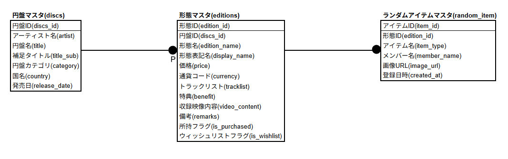

# SHINee Collection Tracker 💎

SHINeeのCD・グッズコレクションを管理・可視化するための個人開発Webアプリケーションです。
就職活動用のポートフォリオとして、「自分が本当に使いたいツール」を形にしました。

## 🌟 主な機能

- **進捗可視化ダッシュボード**: 
  - 全体の収集率をプログレスバーで表示。
  - メンバー別（円形バー）や国別（日本/韓国）の進捗状況をリアルタイムで集計。
- **コレクション管理**: 
  - 所持済みのエディションにチェックを入れるだけで進捗に反映。
- **ウィッシュリスト**: 
  - トラッカーページで「欲しい」ボタンを押したアイテムを自動リスト化。
- **ランダムアイテム管理**: 
  - 特典写真などのアップロード・管理機能。 
- **バッジシステム**: 
  - 特定の条件を達成するとバッジが光るゲーミフィケーション要素。

## 🛠 技術スタック

### バックエンド
- **Java 17 / Spring Boot**: データ管理・API作成（MasterDataController等）。
- **Supabase (PostgreSQL)**: データベース。

### フロントエンド
- **HTML5 / CSS3**: `rem`や`vh`を用いた、スマホでも崩れないレスポンシブ設計。
- **JavaScript (Vanilla JS)**: UIの動的制御、非同期通信（Fetch API）。

## 📊 データベース設計 (ER図)

複雑なディスコグラフィを効率的に管理するため、**IDEF1X記法**に基づき正規化を行いました。

- [ER図の詳細 (PDF版)](./docs/er-diagram.pdf) ※主キー等の詳細確認用

### 設計の工夫
- **補足タイトル (`title_sub`)**: 
  韓国盤の「第○集」や「Repackage」、日本盤・韓国盤で同名タイトルが存在するアルバム/シングルの識別のために導入。これによりデータの一意性と視認性を両立させました。
- **「所持」と「ウィッシュリスト」の分離**: 
  `is_purchased` (所持フラグ) と `is_wishlist` (ウィッシュリストフラグ) を独立させることで、「持っているもの」の可視化だけでなく、「次に欲しいもの」をリストアップするユーザー体験(UX)を考慮した設計にしています。
- **柔軟な拡張性**: 
  「形態マスタ」と「ランダムアイテムマスタ」を切り出すことで、1つのCDに対して複数の特典アイテム（トレカ等）を紐付けられる 1:対:多 の関係を構築しています。

## 💎 こだわりポイント

### 1. セキュリティと保守性
- **環境変数の活用**: DBの接続情報などの機密情報は、ソースコードに直接含めず環境変数（`launch.json`やサーバー設定）で管理。
- **コードの整理**: `js`ファイルを機能別に分割し、メンテナンス性を向上。

### 2. 徹底したレスポンシブ設計
- 就活での提示を意識し、スマホ・PCどちらで見てもレイアウトが美しく保たれるよう、相対単位（rem/vh）を徹底。

### 3. SHINeeの世界観を再現
- メンバー別のカラー（5色）をベースにしたデザイン。

## 📈 現在の進捗状況：90% (Beta)
主要な機能はすべて実装・デバッグ済みです。
本アプリは現在ポートフォリオとして制作中であり、現在はデータベース全体のデータを表示する共通管理仕様となっていますが、以下のアップデートを予定しています。
- [x] DB・バックエンド（Spring Boot）の完全連携
- [x] メンバー別・国別の進捗集計ロジック
- [x] 画像アップロード機能の実装（RandomItem管理）
- [x] セキュリティ対策（環境変数による機密情報管理）
- [x] 本番環境（Railway）へのデプロイ

## 🚀 今後の展望
- **ユーザー別データ管理機能**: 各ユーザーが個別のコレクションを管理できるマイページ機能の実装。
- **検索・フィルタ機能の高度化**: 大量なデータの中から目的の盤をすぐに見つけられるUIの追求。
- **エラーハンドリングの強化**: ユーザーの操作ミスや通信エラー時にも親切なフィードバックを返す仕組みの導入。
- **ランダム管理機能の拡張**: 複数枚の画像登録や、メンバー別のソート機能など、より利便性の高いUIへの改良。
- **データベースの継続的な更新**: 最新アルバムの追加に加え、過去の全ディスコグラフィの完全網羅。
- **映像作品（DVD/Blu-ray）への対応**: アルバムだけでなく、ライブ映像やファンミーティング等のDVD/Blu-rayも一括管理できるデータ構造への拡張。

### ⚠️ 既知の課題（修正対応中）
- **画像表示の不具合（Railway環境）**: 
  現在、Railwayにデプロイした環境において、アップロードした画像が一部正常に表示されない事象を確認しています。
  原因はファイルパスの設定またはストレージの永続化設定によるものと特定しており、次回のアップデートにて修正予定です。
  （ローカル環境では正常に動作することを確認済みです）